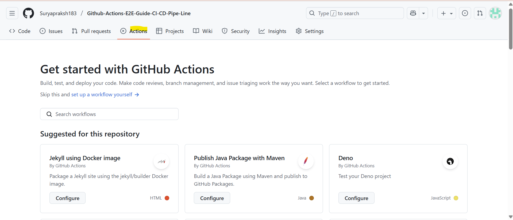

# Java + Selenium CI/CD Pipeline with GitHub Actions  
A hands-on guide to setting up automated testing with GitHub Actions, including real screenshots at every step for easy learning.

---

## 📖 Table of Contents
- [Overview](#overview)
- [Project Structure](#project-structure)
- [Step 1: Creating Your GitHub Actions Workflow](#step-1-creating-your-github-actions-workflow)
- [Step 2: Using/Configuring Runners](#step-2-usingconfiguring-runners)
  - [A. GitHub-Hosted Runners](#a-github-hosted-runners)
  - [B. Self-Hosted Runner Setup](#b-self-hosted-runner-setup)
- [Step 3: Environment Variables, Secrets & Variables](#step-3-environment-variables-secrets--variables)
- [Step 4: Setting up Scheduled/Periodic Runs](#step-4-setting-up-scheduledperiodic-runs)
- [Step 5: Example Full Workflow YAML](#step-5-example-full-workflow-yaml)
- [Best Practices & Tips](#best-practices--tips)
- [References](#references)

---

## Overview
This guide will help you implement and run a **CI/CD pipeline** in GitHub Actions for automated Java Selenium tests, using both GitHub-hosted and (optionally) self-hosted runners, environment variables/secrets, and scheduled triggers.  
Screenshots are included at every step. Update the image links once your screenshots are uploaded to `images/`.

---

## Project Structure

```
.
├── src/test/java/
├── src/main/java/
├── pom.xml
├── testng.xml
├── .github/
│    └── workflows/
│         └── ci.yml
├── images/
└── README.md
```

---

## Step 1: Creating Your GitHub Actions Workflow

1. Navigate to your repository on GitHub.
2. Click on the **Actions** tab.  
    

3. Select **“set up a workflow yourself”** (or start from a template!)  
    

4. Name your workflow file `.github/workflows/ci.yml` and paste the provided YAML (see below).  
    

5. Commit the file to your repository.  
    

---

## Step 2: Using/Configuring Runners

### A. GitHub-Hosted Runners (Default)
- By default, your workflow runs on a fresh, cloud-hosted VM like `ubuntu-latest`.
- No setup required.

  

### B. Self-Hosted Runner Setup

If you want to run jobs on your own infrastructure (for special tools, browsers, or performance):

1. Go to **Settings > Actions > Runners** in your repo.
    

2. Click **“New self-hosted runner”**.
    

3. Follow the displayed steps to copy shell commands to your server:
    1. Download the runner
    2. Configure with repo URL & token
    3. Start the runner process
    

4. The runner should appear as `online` in your GitHub UI.
    

---

## Step 3: Environment Variables, Secrets & Variables  
You’ll often need secrets (e.g., Selenium Grid URL) or app variables.

### A. Setting Repository Variables & Secrets

1. Go to **Settings > Secrets and variables > Actions**  
    

2. Click “New repository secret” or “New variable”  
    

3. Fill the details and save.
    

4. Reference them in your workflow:
    ```yaml
      env:
        SELENIUM_GRID_URL: ${{ secrets.SELENIUM_GRID_URL }}
        BASE_URL: ${{ vars.BASE_URL }}
    ```

---

## Step 4: Setting up Scheduled/Periodic Runs

- You can make your pipeline run at custom times using `on.schedule` and a cron syntax.
- Example schedule to run daily at 6 am UTC:

    ```yaml
    on:
      schedule:
        - cron: '0 6 * * *'
    ```

- View and monitor scheduled runs on the Actions tab.
    

---

## Step 5: Example Full Workflow YAML

Here’s a full example which supports all these features:

```yaml
name: Java Selenium CI

on:
  push:
    branches: [main]
  pull_request:
    branches: [main]
  schedule:
    - cron: '15 2 * * *'   # Scheduled run at 2:15AM UTC
  workflow_dispatch:

jobs:
  build-and-test:
    runs-on: ubuntu-latest         # or 'self-hosted' for your own runner
    env:
      BASE_URL: ${{ vars.BASE_URL }}
      SELENIUM_GRID_URL: ${{ secrets.SELENIUM_GRID_URL }}
      TEST_ENV: staging

    steps:
      - name: Checkout repository
        uses: actions/checkout@v4
        # 
        
      - name: Set up JDK 17
        uses: actions/setup-java@v4
        with:
          distribution: 'temurin'
          java-version: '17'
        # 

      - name: Cache Maven dependencies
        uses: actions/cache@v4
        with:
          path: ~/.m2
          key: ${{ runner.os }}-maven-${{ hashFiles('**/pom.xml') }}
          restore-keys: ${{ runner.os }}-maven-
        # 

      - name: Run Selenium Tests
        run: mvn clean test -Denv=$TEST_ENV -Dbrowser=chrome -Dselenium.grid.url=$SELENIUM_GRID_URL
        # 

      - name: Archive Reports
        uses: actions/upload-artifact@v3
        with:
          name: surefire-reports
          path: target/surefire-reports
        # 

      - name: (Optional) Notify Slack
        if: failure()
        uses: rtCamp/action-slack-notify@v2
        env:
          SLACK_WEBHOOK: ${{ secrets.SLACK_WEBHOOK }}
          SLACK_MESSAGE: "Build failed (${ GITHUB_WORKFLOW }) for ${{ github.ref }}"
        # 
```

---

## Best Practices & Tips
- Always use secrets for sensitive data.
- For community projects: include screenshots for every step for easy onboarding.
- Give your workflow jobs/steps descriptive names.
- Monitor workflow runs in the Actions tab.
    

---

## References
- [GitHub Actions Workflow Syntax](https://docs.github.com/en/actions)
- [Setting up self-hosted runners](https://docs.github.com/en/actions/hosting-your-own-runners/adding-self-hosted-runners)
- [Encrypted Secrets](https://docs.github.com/en/actions/security-guides/encrypted-secrets)
- [Scheduled workflows](https://docs.github.com/en/actions/using-workflows/events-that-trigger-workflows#schedule)
---

*Replace all the `images/...png` links with your own actual screenshots as you perform each step!*
